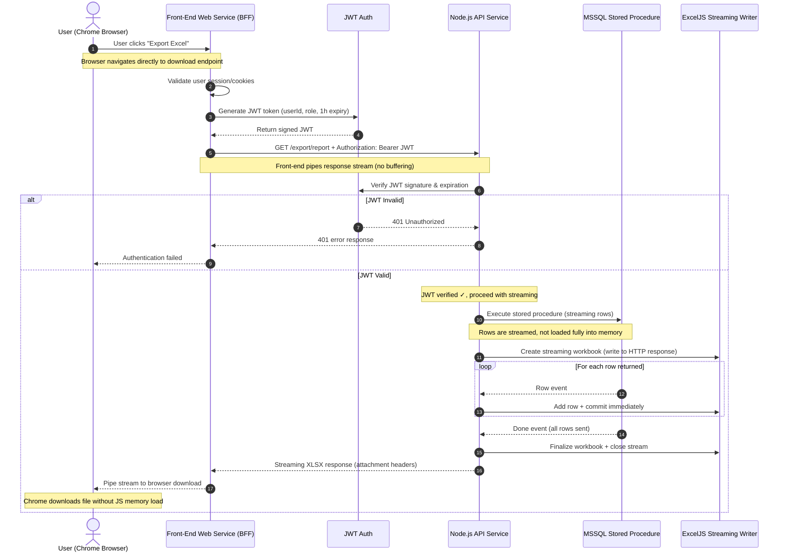

# Streaming Excel Export — High-Level Sequence Diagram

```mermaid
sequenceDiagram
  autonumber

  actor U as User (Chrome Browser)
  participant FE as Front-End Web Service (BFF)
  participant AUTH as JWT Auth
  participant API as Node.js API Service
  participant DB as MSSQL Stored Procedure
  participant XLSX as ExcelJS Streaming Writer

  U->>FE: User clicks "Export Excel"
  note over U,FE: Browser navigates directly to download endpoint

  FE->>FE: Validate user session/cookies
  
  FE->>AUTH: Generate JWT token (userId, role, 1h expiry)
  AUTH-->>FE: Return signed JWT

  FE->>API: GET /export/report + Authorization: Bearer JWT
  note over FE,API: Front-end pipes response stream (no buffering)

  API->>AUTH: Verify JWT signature & expiration
  
  alt JWT Invalid
    AUTH-->>API: 401 Unauthorized
    API-->>FE: 401 error response
    FE-->>U: Authentication failed
  else JWT Valid
    note over API: JWT verified ✓, proceed with streaming

    API->>DB: Execute stored procedure (streaming rows)
    note over API,DB: Rows are streamed, not loaded fully into memory

    API->>XLSX: Create streaming workbook (write to HTTP response)

    loop For each row returned
      DB-->>API: Row event
      API->>XLSX: Add row + commit immediately
    end

    DB-->>API: Done event (all rows sent)

    API->>XLSX: Finalize workbook + close stream

    API-->>FE: Streaming XLSX response (attachment headers)
    FE-->>U: Pipe stream to browser download

    note over U: Chrome downloads file without JS memory load
  end
```
